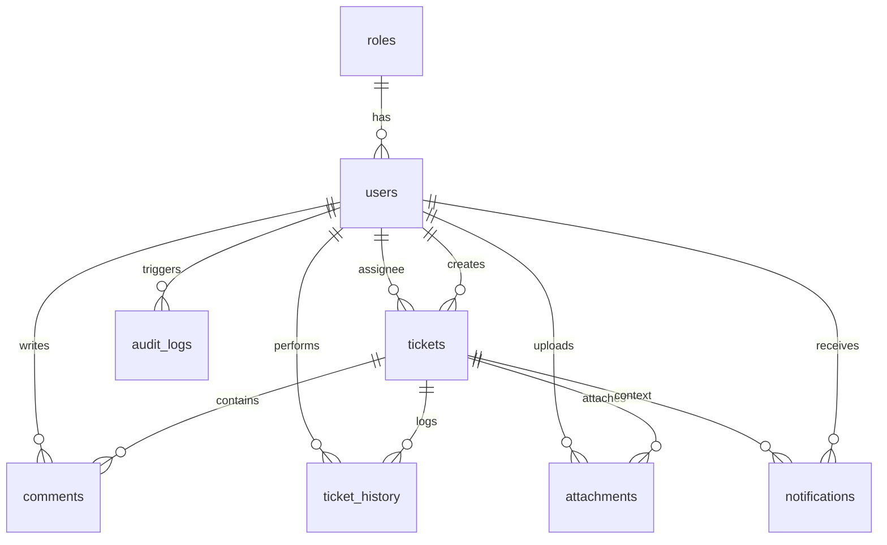

# Enterprise IT Help Desk & Ticket Management System

An enterprise-grade IT Help Desk & Ticket Management system developed in Spring Boot 3 (Java 21) and React, styled with glassmorphism CSS. This system represents an industry-standard full-stack project utilizing Spring Security, JWT session tokens, JPA Hibernate, and MySQL.

---

## 🏗️ Architecture Design



---

## 🛠️ Technology Stack

### Backend
- **Java**: Version 21 (LTS)
- **Framework**: Spring Boot 3.2.4
- **Security**: Spring Security 6 (JWT Authentication & Role-Based Authorization)
- **Database Access**: Spring Data JPA & Hibernate
- **Database**: MySQL 8.x
- **Build Tool**: Apache Maven
- **Dependencies**: Lombok, JSR-380 Validation, WebSocket (STOMP), OpenPDF (PDF Export), Apache POI (Excel Export), Springdoc OpenAPI (Swagger)

### Frontend
- **Framework**: React 18 (Vite Scaffolding)
- **Routing**: React Router DOM v6
- **Forms**: React Hook Form
- **Charts**: Chart.js & React-Chartjs-2
- **Icons**: Lucide React
- **Theme**: Glassmorphism CSS, Bootstrap grid integration, Light/Dark Modes

---

## 📂 Project Structure

```text
IT Support Java/
├── client/                      # React frontend
│   ├── src/
│   │   ├── components/          # Reusable UI components (Tables, Skeletons)
│   │   ├── context/             # Auth and Theme state providers
│   │   ├── pages/               # Dashboard, Auth, Ticket Details, Profile
│   │   ├── App.jsx              # Routes & guards
│   │   ├── index.css            # Glassmorphism design tokens
│   │   └── main.jsx             # DOM binding
│   └── package.json
├── server/                      # Spring Boot backend
│   ├── src/main/java/com/itdesk/
│   │   ├── config/              # Security config, WebSockets, DB Initializer
│   │   ├── controller/          # REST Controllers
│   │   ├── dto/                 # Request & Response wrappers
│   │   ├── entity/              # Hibernate JPA mappings
│   │   ├── exception/           # Global Exception Handling
│   │   ├── repository/          # JPA Repositories
│   │   ├── security/            # JWT filters, UserPrincipal
│   │   └── service/             # Business Logic & Exports
│   ├── pom.xml
│   └── uploads/                 # Local filesystem storage for attachments
└── database/                    # SQL Schema & seeds
    ├── schema.sql               # MySQL tables definitions
    └── data.sql                 # Sample seed data
```

---

## 🔑 Default User Accounts (Seed Data)

All accounts default to password: `password123`

| Username | Email | Role | Department | Description |
| :--- | :--- | :--- | :--- | :--- |
| **admin** | `admin@itdesk.com` | `ROLE_ADMIN` | IT Administration | System Admin |
| **support1** | `support1@itdesk.com` | `ROLE_SUPPORT` | L1 App Support | Support Engineer |
| **support2** | `support2@itdesk.com` | `ROLE_SUPPORT` | Network Ops | Network Specialist |
| **employee1** | `emp1@itdesk.com` | `ROLE_EMPLOYEE` | Software Eng | Standard employee |
| **employee2** | `emp2@itdesk.com` | `ROLE_EMPLOYEE` | Finance | Standard employee |

---

## ⚡ Setup & Run Instructions

### 1. Database Setup
1. Ensure MySQL server is running locally on port `3306`.
2. Create a database named `it_support_db`:
   ```sql
   CREATE DATABASE it_support_db;
   ```
3. (Optional) Run the SQL scripts located in `database/schema.sql` and `database/data.sql`. If skipped, the backend's `DatabaseInitializer` will automatically seed default roles, users, and tickets on first boot.

### 2. Backend Server Setup
1. Open a terminal and navigate to the `server` directory:
   ```bash
   cd server
   ```
2. Verify credentials in `server/src/main/resources/application.properties`:
   - `spring.datasource.username` (default: `root`)
   - `spring.datasource.password` (default: `root`)
3. Compile and launch the application:
   ```bash
   mvn spring-boot:run
   ```
4. The server runs at `http://localhost:8080` with API context `/api`.
5. Swagger API Docs: `http://localhost:8080/swagger-ui.html`

### 3. Frontend Client Setup
1. Open a terminal and navigate to the `client` directory:
   ```bash
   cd client
   ```
2. Install npm dependencies:
   ```bash
   npm install
   ```
3. Run the development server:
   ```bash
   npm run dev
   ```
4. Access the web app in the browser at `http://localhost:5173`.

---

## 🔌 API Documentation Summary

### 🔐 Authentication APIs (`/api/auth`)
- `POST /login` - Sign in using username/email. Returns JWT and user object.
- `POST /register` - Create a new user profile.
- `POST /forgot-password` - Request a password recovery token (UUID printed to logs).
- `POST /reset-password` - Reset password using the recovery token.

### 🎟️ Ticket APIs (`/api/tickets`)
- `POST /` - Create a new ticket (Employee).
- `GET /` - Retrieve all tickets with filters (`status`, `priority`, `category`, `search`).
- `GET /{id}` - Get ticket detail parameters.
- `PUT /{id}` - Update ticket title/description/category.
- `PUT /{id}/assign` - Assign to a Support Engineer (Admin/Support).
- `PUT /{id}/status` - Update ticket lifecycle state (Admin/Support/Employee).
- `PUT /{id}/escalate` - Escalate priority rating (Admin/Support).
- `GET /{id}/history` - Retrieve chronological activity logs.
- `POST /{id}/attachments` - Upload a file attachment (max 10MB).
- `GET /{id}/attachments` - Fetch all attachment meta.
- `GET /attachments/{attachmentId}` - Download the binary file.

### 💬 Comment APIs (`/api/tickets/{ticketId}/comments`)
- `POST /` - Add a new discussion message.
- `GET /` - List discussion logs chronologically.

### 🔔 Notification APIs (`/api/notifications`)
- `GET /` - Fetch in-app notifications list.
- `GET /unread-count` - Count unread alerts.
- `PUT /{id}/read` - Mark a specific notification as read.
- `PUT /read-all` - Mark all notifications as read.

### 📊 Dashboard & Reports APIs
- `GET /api/dashboard/stats` - Fetch aggregate stats for charts.
- `GET /api/reports/export/excel` - Download an Excel sheet.
- `GET /api/reports/export/pdf` - Download a PDF report.
- `GET /api/reports/audit-logs` - View security actions logs (Admin only).
